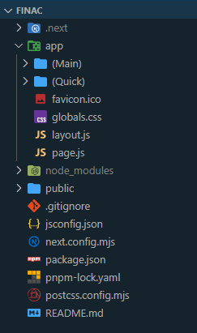
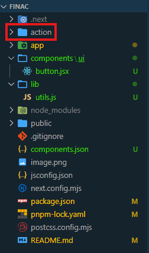
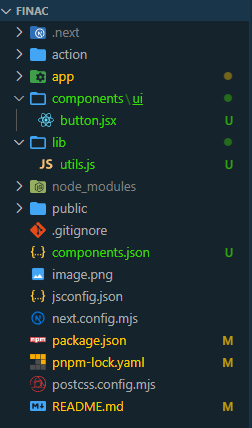

# Finac Bank - Personal Finance Tracker App

## Setup

1. Create Next Js project
2. Update layout.js & page.js
3. Added folders - action, DB
4. Add shadcn to project
5. Create folder in components - AppLayout, Providers
6. Added new file ThemeProvider - for that install theme from shadcn

## Tech Used

1. NextJs
2. TailwindCss
3. Shadcn

## 1. Run this - to create NextJs project

```pnpm
pnpx create-next-app@lates
```

## This is initial project setup



## 2. Update Layout.js & page.js file

## 3. Create Action folder for server action



## 4. Add shadcn UI

```pnpm
pnpm dlx shadcn@latest add button
```

Used Slate UI for project. Now project structure is updated as shown below.



## 6. Add ThemeProvider.jsx to handle theme

```pnpm
pnpm add next-themes
```

Now wrap layout.jsx body tag inside themeprovider

```jsx
<html lang="en">
  <body className={`${inter.className} antialiased`}>
    <ThemeProvider
      attribute="class"
      defaultTheme="system"
      enableSystem
      disableTransitionOnChange
    >
      {children}
    </ThemeProvider>
  </body>
</html>
```

## 7. Add ModeToggle.jsx to handle theme dark mode

```jsx
"use client";
import React from "react";
import { Button } from "../ui/button";
import { useTheme } from "next-themes";
import { Sun, Moon } from "lucide-react";

const ModeToggle = () => {
  const { theme, setTheme } = useTheme();
  return (
    <div>
      <Button
        size="icon"
        variant="ghost"
        onClick={() =>
          theme === "light" ? setTheme("dark") : setTheme("light")
        }
      >
        {theme === "light" ? <Moon /> : <Sun />}
      </Button>
    </div>
  );
};

export default ModeToggle;
```

## 8. Add AppSidebar.jsx
